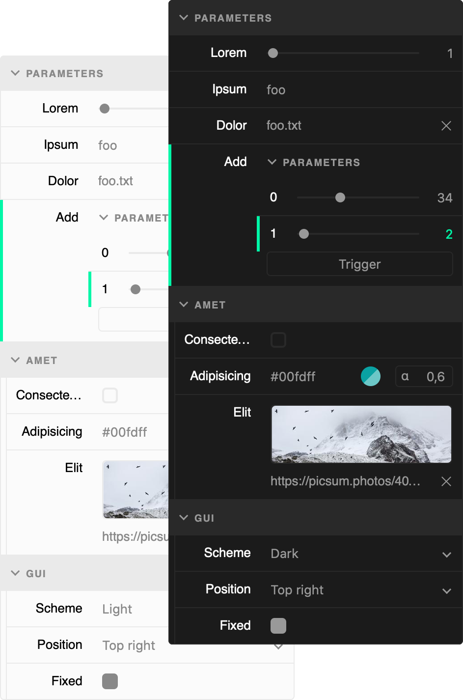

# GUI

[](https://github.com/juliendargelos/gui/actions?workflow=test)
[](https://github.com/juliendargelos/gui/actions?workflow=build)
[](https://github.com/juliendargelos/gui)

*Light and expressive GUI with web components*<br>
**[Go to demo](https://juliendargelos.com/gui)**

```typescript
const target = {
  lorem: 1,
  ipsum: 'foo',
  dolor: new File([], 'foo.txt'),
  sit: (name: string) => alert(`Hey ${name}`),
  amet: {
    consectetur: false,
    adipisicing: 'rgba(35, 50, 75, 0.5)',
    elit: 'https://picsum.photos/400/200.jpg'
  }
}

const gui = new GUI({ target })
  .add('lorem')
  .add('ipsum')
  .add('dolor')
  .add('sit', { args: [{ value: 'Bob' }] })
  .group('amet', group => group
    .add('consectetur')
    .add('adipisicing')
    .add('elit')
  )
```

### Install

*Not published yet*

<!--
```bash
npm install @juliendargelos/gui --save
```

```bash
yarn add @juliendargelos/gui
```
!-->

### Usage

*Documentation coming soon*
